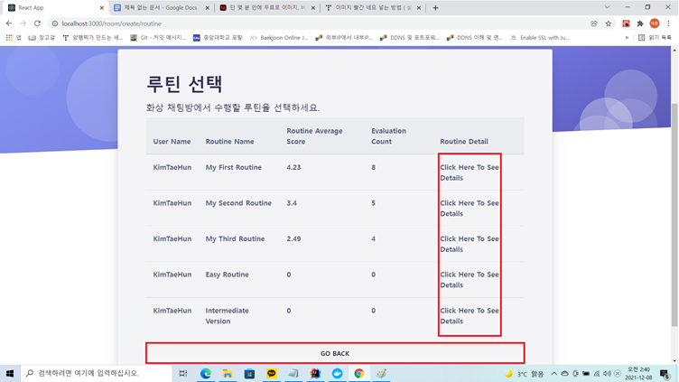
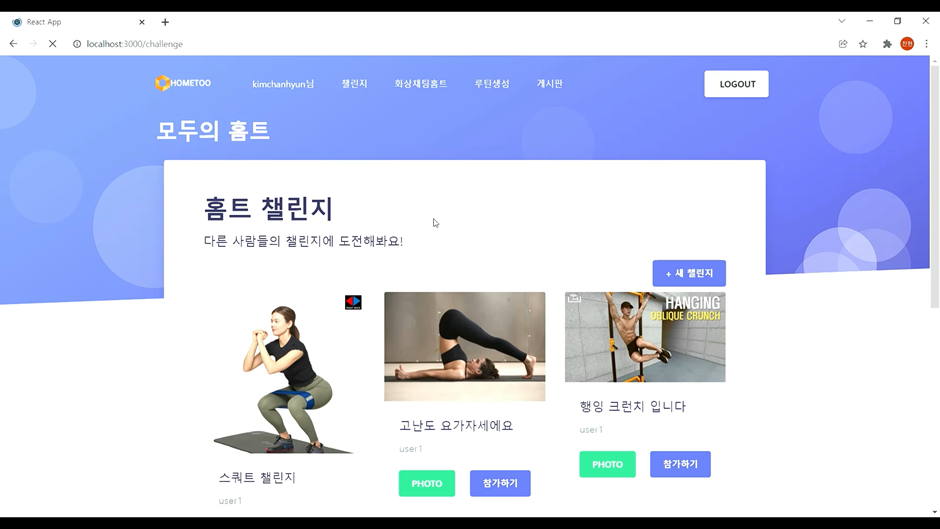
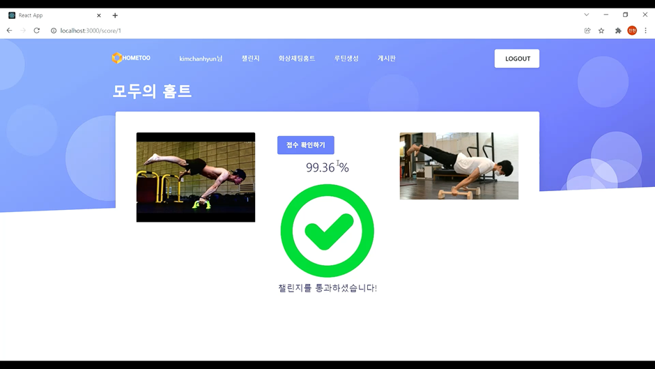

모두의 홈트
===========

### [프로젝트 설명]
- 모두의 홈트는 비대면 홈트레이닝 커뮤니티입니다. 꾸준한 운동을 위해 동기부여가 중요한 홈트레이닝에서 사용자의 의욕증진을 위해 화상세션을 통한 그룹 홈트레이닝, 유저가 직접 생성하고 참여하는 자세 챌린지 기능을 제공합니다.

### [담당 역할]
- 백엔드 엔지니어
- 자세 유사도 알고리즘 구현

### [기술스택]
 - Springboot, Mysql, React

### [상세구현]
- WebRTC 기능을 이용한 화상 세션기능
- 카카오 포즈 API를 이용한 자세 분석 기능

### [성과 및 결과]
- 자세 챌린지 기능을 담당하여 유저가 업로드하는 미디어 파일을 저장하고 이를 Open APi 요청에 사용하는 과정을 구현하였습니다. 
- 많은 양의 API 응답 결과를 적절히 파싱하고 DB에 저장하는 방법을 구현하였습니다.

### [서비스 화면]
- 루틴 관리

- 화상 세션

- 자세 챌린지

- 점수 확인

